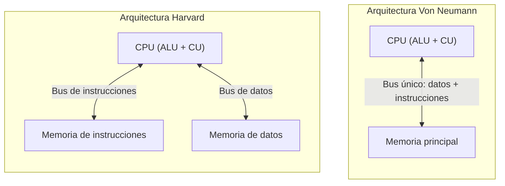

# Fundamentos de Hardware y Software

Antes de hablar de procesos, memoria o interbloqueos, conviene tener claro **sobre qué corre realmente un sistema operativo**: el hardware que administra, y cómo se relaciona con las distintas capas de software. Esta página funciona como base de referencia para el resto de la wiki.

## El hardware que el SO administra

### Periféricos

Los periféricos son los dispositivos que conectan la computadora con el mundo exterior:

- **De entrada:** teclado, ratón, escáner, micrófono, cámara web, sensores biométricos. Introducen datos hacia la CPU.
- **De salida:** monitor, impresora, parlantes, proyector. Presentan al usuario el resultado del procesamiento.

El SO no accede a estos dispositivos "a mano": lo hace a través de **controladores (drivers)**, programas especializados que traducen las peticiones genéricas del kernel a los comandos específicos de cada fabricante de hardware. Esta capa de abstracción es la razón por la que, como usuarios, no necesitamos saber el modelo exacto de nuestra impresora para poder imprimir.

### El procesador (CPU)

La CPU es el componente que ejecuta instrucciones. Sus partes principales:

- **ALU (Unidad Aritmético-Lógica):** ejecuta operaciones aritméticas (suma, resta, multiplicación) y lógicas (AND, OR, NOT).
- **CU (Unidad de Control):** decodifica las instrucciones obtenidas de memoria y genera las señales que coordinan al resto del procesador.
- **Registros:** memoria ultra rápida dentro del propio chip. Incluyen el **Contador de Programa (PC)**, que apunta a la próxima instrucción a ejecutar, y el **Registro de Instrucción (IR)**, que guarda la instrucción actual.
- **Reloj:** genera los pulsos (medidos en Hz/GHz) que sincronizan cada paso del procesador.
- **MMU (Unidad de Gestión de Memoria):** traduce direcciones de memoria virtual a físicas — un componente clave que se retoma más adelante en la unidad de administración de memoria.

Este ciclo de "buscar instrucción → decodificar → ejecutar" se conoce como el **ciclo de instrucción**, y es la base de cómo el SO logra dar la ilusión de que muchos programas corren "a la vez": en realidad la CPU va y viene rapidísimo entre ellos.

## Arquitecturas de computadoras

### Arquitectura de Von Neumann

Propuesta por John von Neumann en 1945, su característica distintiva es el **concepto de programa almacenado**: instrucciones y datos comparten la misma memoria principal. Esto simplificó enormemente el diseño de computadoras y permitió que un programa pudiera tratarse como datos (por ejemplo, para ser modificado por un compilador).

Componentes clave: CPU (ALU + CU), memoria principal (RAM volátil + ROM permanente), unidades de E/S, y buses de datos, direcciones y control que interconectan todo.

Una limitación conocida de este modelo es el llamado **"cuello de botella de Von Neumann"**: como instrucciones y datos comparten el mismo bus, la CPU no puede leer una instrucción y un dato al mismo tiempo, lo que limita la velocidad máxima de procesamiento.

### Arquitectura Harvard

Nace del Harvard Mark I (años 40). A diferencia de Von Neumann, **separa físicamente** la memoria de instrucciones y la memoria de datos, cada una con su propio bus. Esto permite que la CPU acceda a ambas simultáneamente, evitando el cuello de botella mencionado arriba, y permite además que cada memoria tenga un ancho de palabra distinto.

> **Para profundizar:** los procesadores modernos de propósito general (como los que usa una laptop) suelen implementar una versión híbrida, conocida como **arquitectura Harvard modificada**: usan una sola memoria principal (como Von Neumann) pero mantienen cachés de instrucciones y de datos separadas dentro del propio chip, para obtener parte de las ventajas de ambos modelos.

## Software: las capas por encima del hardware

Sobre el hardware corren distintos niveles de software, cada uno con un rol distinto:

1. **Software de sistema:** intermediario entre hardware y usuario. El sistema operativo es el ejemplo principal, pero también incluye utilidades de bajo nivel (gestores de arranque, firmware). Administra CPU, memoria, archivos y dispositivos.
2. **Software de aplicación:** programas orientados a resolver tareas del usuario final (navegadores, procesadores de texto, juegos). Dependen del SO para acceder a los recursos del equipo — es decir, usan llamadas al sistema para hacer su trabajo.
3. **Software de programación:** herramientas para crear otro software: compiladores (traducen código fuente a lenguaje máquina), intérpretes (ejecutan código línea por línea), editores de código e IDEs.

Esta jerarquía explica por qué al sistema operativo se le suele llamar la **base** de todo el ecosistema de software: sin él, ni las aplicaciones de usuario ni las herramientas de desarrollo tendrían una forma estandarizada de hablar con el hardware.

## Ranuras de expansión y buses (contexto adicional)

Aunque es un tema más de arquitectura de computadoras que de sistemas operativos puro, vale la pena mencionarlo porque el SO necesita reconocer y administrar estos dispositivos mediante drivers: las computadoras modernas usan principalmente **PCI Express (PCIe)**, un estándar serial que reemplazó a ISA, PCI y AGP, y que varía en tamaño (x1, x4, x8, x16) según el ancho de banda que necesita cada tarjeta (red, almacenamiento NVMe, tarjetas gráficas). En cuanto a puertos externos, el ecosistema ha convergido fuertemente hacia **USB-C**, capaz de transportar datos, video y energía en un solo conector, reemplazando estándares antiguos como PS/2 o VGA.