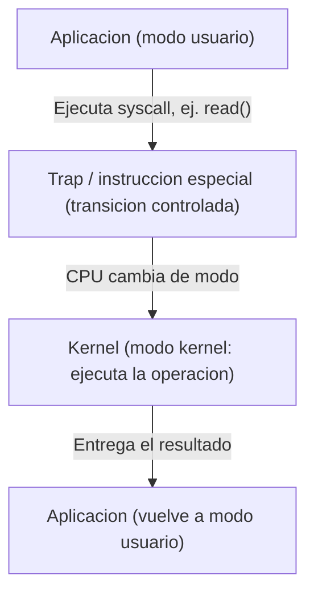

# Llamadas al Sistema, Protección y Clasificación de los SO

## El problema de la protección

Un sistema operativo no solo organiza recursos: también tiene que **evitar que un programa dañe a otro o al propio sistema**. Si cualquier aplicación pudiera escribir directamente en el disco o apagar interrupciones, un solo programa mal hecho (o malicioso) podría tumbar toda la computadora. Por eso el hardware de los procesadores modernos define **niveles de privilegio**, y el SO se apoya en ellos para separar lo que puede hacer una aplicación de lo que puede hacer el núcleo.

### Modo usuario vs. modo kernel

- **Modo usuario:** es donde corren las aplicaciones normales (tu navegador, un editor de texto, un juego). En este modo, el procesador **bloquea** el acceso directo a hardware crítico, a memoria de otros procesos y a instrucciones privilegiadas (como cambiar el modo de operación del CPU).
- **Modo kernel (o supervisor):** es donde corre el núcleo del sistema operativo. Aquí sí hay acceso total al hardware: manejo de memoria física, controladores de dispositivos, planificación de procesos, etc.

La CPU guarda en un registro especial (a menudo llamado *processor status word* o similar, según la arquitectura) un bit que indica en qué modo está corriendo en ese instante. Cualquier intento de ejecutar una instrucción privilegiada estando en modo usuario genera una **excepción de protección**, que el propio hardware entrega al SO para que decida qué hacer (normalmente, terminar el programa).

### ¿Cómo pide entonces una aplicación un servicio del SO?

Aquí es donde entran las **llamadas al sistema (system calls)**. Cuando un programa en modo usuario necesita algo que solo el kernel puede hacer —abrir un archivo, reservar memoria, crear un proceso hijo, enviar datos por red— no lo hace directamente: ejecuta una instrucción especial (por ejemplo `syscall` en x86-64, o `svc` en ARM) que provoca una **transición controlada** de modo usuario a modo kernel.

El flujo típico es:

1. El programa coloca en registros específicos el número de la llamada al sistema y sus argumentos.
2. Ejecuta la instrucción de trampa (`trap`) que el hardware interpreta como "pásame al kernel de forma segura".
3. El CPU cambia al modo kernel y salta a una dirección fija predefinida: el **manejador de llamadas al sistema**.
4. El kernel identifica qué llamada se pidió, valida los argumentos (nunca confía ciegamente en el programa que llamó) y ejecuta la operación.
5. Al terminar, regresa el resultado y devuelve el control al programa, restaurando el modo usuario.

Este mecanismo es la única "puerta" oficial entre el mundo de las aplicaciones y el mundo del kernel. Linux, por ejemplo, expone varios cientos de llamadas al sistema (`read`, `write`, `fork`, `execve`, `mmap`, entre otras), documentadas en la sección 2 del manual (`man 2 syscalls`).

> **Para profundizar:** en años recientes han aparecido mecanismos como `io_uring` en Linux, que reduce la cantidad de transiciones usuario-kernel necesarias para operaciones de entrada/salida, porque cada cambio de modo tiene un costo de rendimiento (guardar y restaurar el estado del procesador). Esto muestra que el diseño de las syscalls no es solo un detalle técnico: afecta directamente el desempeño de todo el sistema.

## Clasificación de los sistemas operativos

Los sistemas operativos se pueden clasificar desde distintos ángulos. No son categorías excluyentes: un mismo SO puede describirse con varias de ellas a la vez.

### Según el número de usuarios

| Tipo | Descripción | Ejemplos |
|---|---|---|
| Monousuario | Una sola persona usa el sistema a la vez | MS-DOS |
| Multiusuario | Varios usuarios pueden acceder simultáneamente, local o remotamente | Linux, UNIX, Windows Server |

### Según el número de tareas

| Tipo | Descripción | Ejemplos |
|---|---|---|
| Monotarea | Ejecuta un solo proceso a la vez | MS-DOS |
| Multitarea | Gestiona múltiples procesos "al mismo tiempo" mediante planificación de CPU | Windows, macOS, Linux |

### Según el tipo de dispositivo

- **Sistemas de escritorio:** interfaz gráfica completa, gestión de archivos, gran variedad de aplicaciones (Windows 10/11, Ubuntu Desktop, macOS).
- **Sistemas móviles:** priorizan eficiencia energética y conectividad (Android, iOS).
- **Sistemas embebidos y de tiempo real (RTOS):** dedicados a una función específica, con tiempos de respuesta garantizados; se usan en industria, autos, medicina (FreeRTOS, QNX, VxWorks).

### Según la arquitectura del núcleo

- **Monolítico:** todos los servicios del SO (manejo de archivos, drivers, memoria) corren en un solo espacio de memoria privilegiado. Es rápido porque no hay tantas transiciones de contexto internas, pero un error en un driver puede tumbar todo el kernel. Ejemplo: Linux.
- **Microkernel:** el núcleo solo incluye lo mínimo indispensable (comunicación entre procesos y gestión básica de memoria); servicios como sistemas de archivos o drivers corren como procesos separados en espacio de usuario. Es más seguro y modular, pero cada comunicación entre servicios cuesta una llamada adicional. Ejemplo: MINIX, QNX.
- **Híbrido:** combina ambos enfoques: un núcleo más grande que un microkernel puro, pero que delega ciertos servicios a componentes externos. Ejemplo: Windows NT, macOS (XNU).

## Comparativa práctica: Windows vs. Linux

| Aspecto | Windows | Linux |
|---|---|---|
| Modelo | Código cerrado (propietario) | Código abierto |
| Costo | Licencia de pago | Gratuito (la mayoría de distros) |
| Kernel | Híbrido | Monolítico modular |
| Personalización | Limitada | Muy alta (se puede modificar y recompilar el kernel) |
| Uso típico | Escritorio doméstico y empresarial | Servidores, supercomputadoras, dispositivos embebidos, y escritorio |
| Creador / origen | Microsoft | Linus Torvalds, 1991, basado en los principios de UNIX |

Linux no es un sistema único, sino un **kernel** sobre el cual distintas organizaciones arman **distribuciones** completas (Ubuntu, Fedora, Debian, Arch, etc.), cada una con su propio gestor de paquetes y filosofía. Esto contrasta con Windows, donde Microsoft controla tanto el kernel como la distribución completa del sistema.

> **Dato para investigar más:** según reportes de participación de mercado en escritorio, Windows mantiene una posición dominante frente a Linux, pero la relación se invierte casi por completo en el mercado de servidores y supercomputadoras, donde Linux es ampliamente mayoritario. Vale la pena que busquen cifras actualizadas (por ejemplo en StatCounter o en el TOP500 de supercomputadoras) para citar datos concretos con fuente.